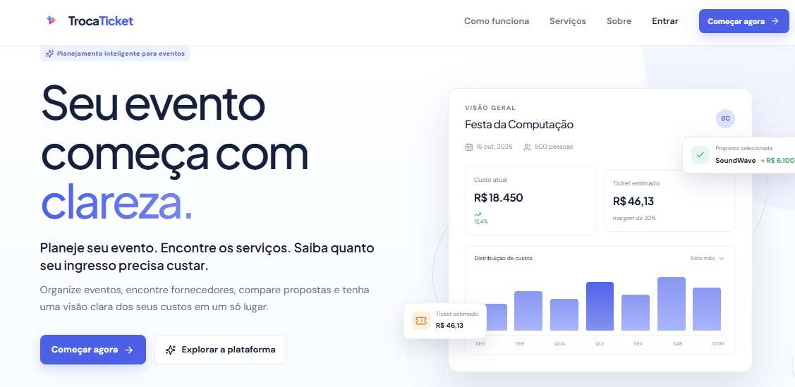

# FECAP - Fundação de Comércio Álvares Penteado

<p align="center">
<a href="https://www.fecap.br/">

</a>
</p>

# TicketLab

## Projeto Interdisciplinar — Ciência da Computação

## Integrantes: <a href="https://github.com/Brian-Walter">Brian Walter</a>, <a href="https://github.com/maxtq">Max Tocantis Quaglia</a>, <a href="https://github.com/Rafael1285">Rafael Nhoncanse</a>

## Professores Orientadores: <a href="https://www.linkedin.com/in/cristina-machado-corr%C3%AAa-leite-630309160/">Cristina Machado Corrêa Leite</a>, <a href="https://www.linkedin.com/in/dolemes/">David de Oliveira Lemes</a>, <a href="https://www.linkedin.com/in/francisco-escobar/">Francisco de Souza Escobar</a>, <a href="https://www.linkedin.com/in/j%C3%A9sus-gomes-83b769108/">Jésus Gomes</a>, <a href="https://www.linkedin.com/in/katia-bossi/">Kátia Bossi</a>

Projeto desenvolvido no curso de Ciência da Computação da FECAP.

## Descrição

<p align="center">

<br>
Tela de home do prototipo da plataforma TicketLab.
</p>

O **TicketLab** é uma plataforma Web desenvolvida como Projeto
Interdisciplinar do curso de Ciência da Computação da FECAP. O sistema
tem como objetivo auxiliar na **organização financeira e no planejamento
de eventos universitários**, conectando organizadores e fornecedores em
um único ambiente.

A plataforma permite que o **Organizador** cadastre eventos, organize
seus custos e acompanhe propostas de fornecedores. O **Fornecedor** pode
consultar oportunidades e enviar propostas para os serviços solicitados.
O **Administrador** é responsável pelo gerenciamento dos usuários,
aprovação de cadastros e acompanhamento das informações do sistema.

A partir dos custos consolidados, do público previsto e da margem de
lucro definida pelo organizador, o TicketLab permite estimar o valor do
ingresso necessário para o evento.

Para o escopo do projeto, cada evento possui apenas um tipo de ingresso.
O MVP não realiza venda de ingressos nem processamento de pagamentos,
tendo como foco o **planejamento, a cotação de fornecedores e a
estimativa do valor do ticket**.

## Funcionalidades

| ID   | Funcionalidade               | Descrição                                                                                     |
| ---- | ---------------------------- | --------------------------------------------------------------------------------------------- |
| RF01 | Autocadastro de Organizador  | Permite que um organizador crie sua conta, que permanece pendente até análise administrativa. |
| RF02 | Autocadastro de Fornecedor   | Permite que um fornecedor realize seu cadastro e aguarde aprovação.                           |
| RF03 | Aprovação de cadastros       | Permite ao administrador aprovar ou rejeitar usuários cadastrados.                            |
| RF04 | Autenticação e perfis        | Controla o acesso conforme o perfil de Administrador, Organizador ou Fornecedor.              |
| RF05 | Cadastro de eventos          | Permite ao organizador cadastrar informações e características do evento.                     |
| RF06 | Itens de composição de custo | Permite organizar serviços e produtos que fazem parte do orçamento do evento.                 |
| RF07 | Custos do evento             | Permite registrar custos operacionais e outros custos não provenientes de propostas.          |
| RF08 | Publicação para cotação      | Disponibiliza eventos e itens para fornecedores aprovados.                                    |
| RF09 | Consulta de eventos          | Permite que fornecedores consultem eventos disponíveis para propostas.                        |
| RF10 | Envio de propostas           | Permite que fornecedores enviem propostas vinculadas aos itens dos eventos.                   |
| RF11 | Comparação de propostas      | Permite ao organizador comparar propostas recebidas.                                          |
| RF12 | Consolidação do orçamento    | Permite selecionar propostas e consolidar os custos do evento.                                |
| RF13 | Cálculo do ticket            | Estima o valor do ingresso com base nos custos, público e margem.                             |
| RF14 | Visão administrativa         | Permite consultas e acompanhamento gerencial das informações do sistema.                      |

### Cálculo do ticket

O cálculo utilizado pelo projeto considera a margem definida sobre a
receita:

```text
Ticket = Custo Total / [Público × (1 − Margem)]
```

O sistema deve realizar as validações necessárias para impedir valores
inválidos durante o cálculo.

## 🛠️ Estrutura de pastas

```text
Projeto8/
│
├── Entrega-1/
│   ├── Calculo-II/
│   ├── Desenvolvimento_web_full_stack/
│   ├── Gestao_empresarial_e_dinamicas_das_organizacoes/
│   ├── Projeto_em_banco_de_dados/
│   └── Projeto_Interdisciplinar_programacao_web/
│
├── Entrega-2/
│   ├── Calculo_II/
│   ├── Desenvolvimento_web_full_stack/
│   ├── Gestao_empresarial_e_dinamicas_das_organizacoes/
│   ├── Projeto_em_banco_de_dados/
│   └── Projeto_Interdisciplinar_programacao_web/
│
├── Imagens/
│
├── src/
│   ├── Backend/
│   │   ├── db.js
│   │   ├── server.js
│   │   ├── package.json
│   │   └── ...
│   │
│   └── Frontend/
│       ├── public/
│       │
│       └── src/
│           ├── assets/
│           ├── pages/
│           │   ├── Cadastro/
│           │   ├── CadastroFornecedor/
│           │   ├── CadastroOrganizador/
│           │   ├── Home/
│           │   ├── Login/
│           │   └── Organizador/
│           │       ├── CriarEvento/
│           │       ├── DashboardOrganizador/
│           │       └── Meuseventos/
│           │
│           └── services/
│
└── README.md
```

### Organização das principais pastas

O projeto está organizado de acordo com as disciplinas e etapas
acadêmicas envolvidas no desenvolvimento do TicketLab.

**`Entrega-1/Calculo-II`**  
Contém os materiais relacionados à disciplina de **Cálculo II**
desenvolvidos para a primeira entrega do projeto.

**`Entrega-1/Desenvolvimento_web_full_stack`**  
Contém a documentação e os materiais relacionados à disciplina de
**Desenvolvimento Web Full Stack** referentes à primeira entrega.

O código-fonte atual da aplicação Web foi organizado posteriormente
em `src/Frontend`.

**`Entrega-1/Gestao_empresarial_e_dinamicas_das_organizacoes`**  
Contém os documentos e materiais desenvolvidos para a disciplina de
**Gestão Empresarial e Dinâmicas das Organizações**, incluindo os
conteúdos relacionados ao planejamento e à proposta de valor do
TicketLab.

**`Entrega-1/Projeto_em_banco_de_dados`**  
Contém a documentação da modelagem do banco de dados, scripts SQL,
diagramas e informações relacionadas à estrutura de dados.

**`Entrega-1/Projeto_Interdisciplinar_programacao_web`**  
Contém a documentação e os materiais relacionados ao Projeto
Interdisciplinar, incluindo o protótipo navegável e as evidências
da entrega.

**`Entrega-2`**  
Área destinada aos materiais das disciplinas e atividades
correspondentes à segunda etapa de entrega do projeto.

**`src/Backend`**  
Código-fonte da API desenvolvida com **Node.js e Express**, responsável
pela comunicação com o banco de dados, autenticação e regras de negócio.

**`src/Frontend`**  
Código-fonte atual da aplicação de **Desenvolvimento Web Full Stack**,
desenvolvida com **React e Vite**, responsável pela interface e
interação com o usuário.

**`Imagens`**  
Contém imagens utilizadas na documentação e apresentação do projeto.

**`README.md`**  
Documentação principal do projeto, reunindo informações sobre as
disciplinas, estrutura, tecnologias, funcionalidades e documentação
do TicketLab.

## 🗄️ Banco de Dados

O TicketLab utiliza **MySQL** como sistema de gerenciamento de banco
de dados.

A documentação da modelagem do banco de dados está disponível na pasta:

[📁 Projeto em Banco de Dados](./Entrega-1/Projeto_em_banco_de_dados/)

### Diagrama do Banco de Dados

O diagrama apresenta as principais entidades, atributos e
relacionamentos utilizados na estrutura do TicketLab.

[📄 Visualizar Diagrama do Banco de Dados (PDF)](./Entrega-1/Projeto_em_banco_de_dados/diagrama-banco.pdf)

Entre as principais entidades utilizadas estão:

- Usuários
- Organizadores
- Fornecedores
- Eventos
- Serviços
- Preços de serviços
- Serviços associados aos eventos

## 🎨 Protótipo

O protótipo navegável do TicketLab foi desenvolvido utilizando o
**Bolt**.

Ele apresenta os principais fluxos e telas da plataforma, contemplando
os módulos de:

- Administrador
- Organizador
- Fornecedor

O protótipo pode ser acessado pelo link abaixo:

[🔗 Acessar protótipo do TicketLab](https://bolt.new/p/71361906)

## ⚙️ Configuração para Desenvolvimento

### Ferramentas necessárias

- Node.js
- npm
- Git
- MySQL
- Visual Studio Code

### Clonar o repositório

```bash
git clone https://github.com/2026-2-MCC2/Projeto8.git
cd Projeto8
```

### Configurar o Backend

Acesse a pasta:

```bash
cd src/Backend
```

Instale as dependências:

```bash
npm install
```

Configure o arquivo `.env` com as informações necessárias para o
banco de dados e para o JWT.

Depois, execute:

```bash
node server.js
```

A API será executada na porta:

```text
http://localhost:3000
```

### Configurar o Frontend

Abra outro terminal e acesse:

```bash
cd src/Frontend
```

Instale as dependências:

```bash
npm install
```

Execute o ambiente de desenvolvimento:

```bash
npm run dev
```

O Vite exibirá no terminal o endereço local da aplicação,
normalmente:

```text
http://localhost:5173
```

## 🎬 Modo Demonstração

O TicketLab possui um **Modo Demonstração** desenvolvido para facilitar
a apresentação e avaliação do projeto.

Esse modo permite acessar o fluxo principal do Organizador sem depender
de uma conta real ou da configuração do banco de dados para o fluxo
demonstrativo.

### Para utilizar

1. Inicie o Backend.
2. Inicie o Frontend.
3. Acesse a aplicação pelo endereço informado pelo Vite.
4. Utilize a opção de **Modo Demonstração** disponível na aplicação.

Os dados utilizados durante o modo demonstração são temporários e
mantidos em memória enquanto o servidor estiver em execução.

## 🚀 Funcionalidades desenvolvidas

- Página inicial
- Login
- Cadastro de Organizador
- Cadastro de Fornecedor
- Autenticação por JWT
- Dashboard do Organizador
- Cadastro de eventos
- Visualização de eventos
- Integração Frontend + Backend
- Integração com MySQL
- Modo Demonstração
- Navegação entre as telas
- Validação de dados
- API REST

## 🛠️ Tecnologias

### Frontend

- React
- React Router
- Vite
- JavaScript
- CSS

### Backend

- Node.js
- Express
- JWT
- bcrypt
- mysql2

### Banco de Dados

- MySQL
- MySQL Workbench

### Desenvolvimento e documentação

- Git
- GitHub
- Postman
- Bolt
- Visual Studio Code

## 📚 Documentação

A documentação do projeto está organizada de acordo com as disciplinas,
etapas e entregas do TicketLab.

### 📦 Entrega 1

- [📐 Cálculo II](./Entrega-1/Calculo-II/)
- [💼 Gestão Empresarial e Dinâmicas das Organizações](./Entrega-1/Gestao_empresarial_e_dinamicas_das_organizacoes/)
- [💻 Desenvolvimento Web Full Stack](./Entrega-1/Desenvolvimento_web_full_stack/)
- [🗄️ Projeto em Banco de Dados](./Entrega-1/Projeto_em_banco_de_dados/)
- [🎨 Projeto Interdisciplinar](./Entrega-1/Projeto_Interdisciplinar_programacao_web/)

### 📦 Entrega 2

- [📐 Cálculo II](./Entrega-2/Calculo_II/)
- [💼 Gestão Empresarial e Dinâmicas das Organizações](./Entrega-2/Gestao_empresarial_e_dinamicas_das_organizacoes/)
- [💻 Desenvolvimento Web Full Stack](./Entrega-2/Desenvolvimento_web_full_stack/)
- [🗄️ Projeto em Banco de Dados](./Entrega-2/Projeto_em_banco_de_dados/)
- [🎨 Projeto Interdisciplinar](./Entrega-2/Projeto_Interdisciplinar_programacao_web/)

### 💻 Código-fonte da aplicação

O código desenvolvido para a aplicação Web está atualmente organizado
na pasta `src/Frontend`:

[📁 Frontend](./src/Frontend/)

A API e as regras de negócio estão organizadas em:

[📁 Backend](./src/Backend/)

## 👥 Equipe

| Integrante            |
| --------------------- |
| Brian Walter          |
| Max Tocantins Quaglia |
| Rafael Nhoncanse      |

## 📖 Referências

1. [React](https://react.dev/)
2. [Vite](https://vite.dev/)
3. [Express](https://expressjs.com/)
4. [MySQL](https://dev.mysql.com/doc/)
5. [Node.js](https://nodejs.org/)
6. [Git](https://git-scm.com/)
7. [Bolt](https://bolt.new/)
8. [Postman](https://www.postman.com/)
